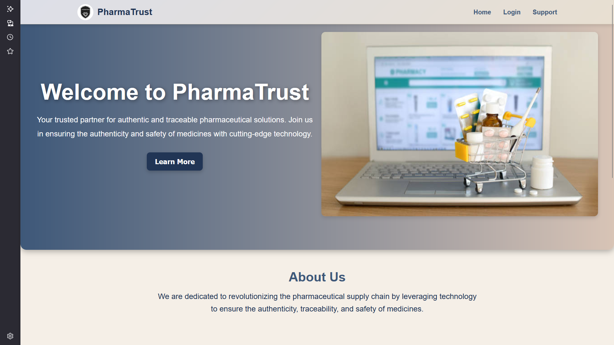
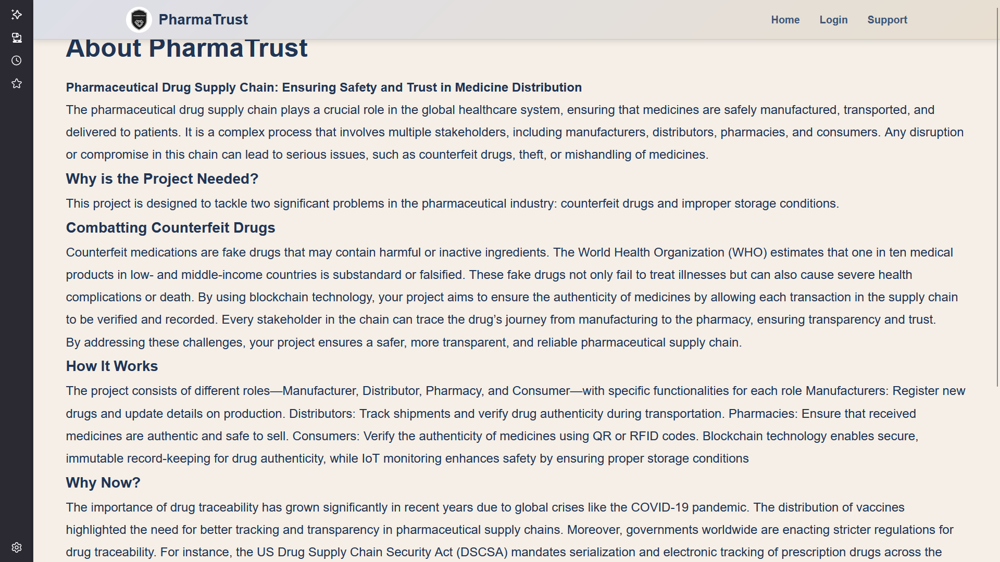
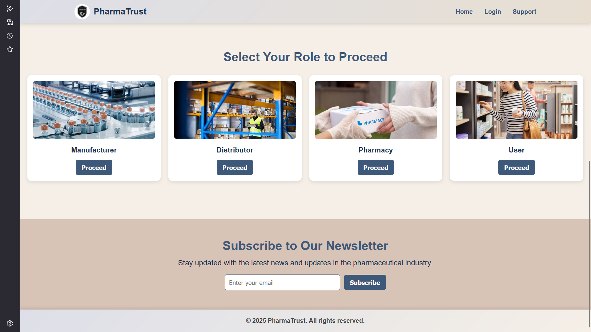
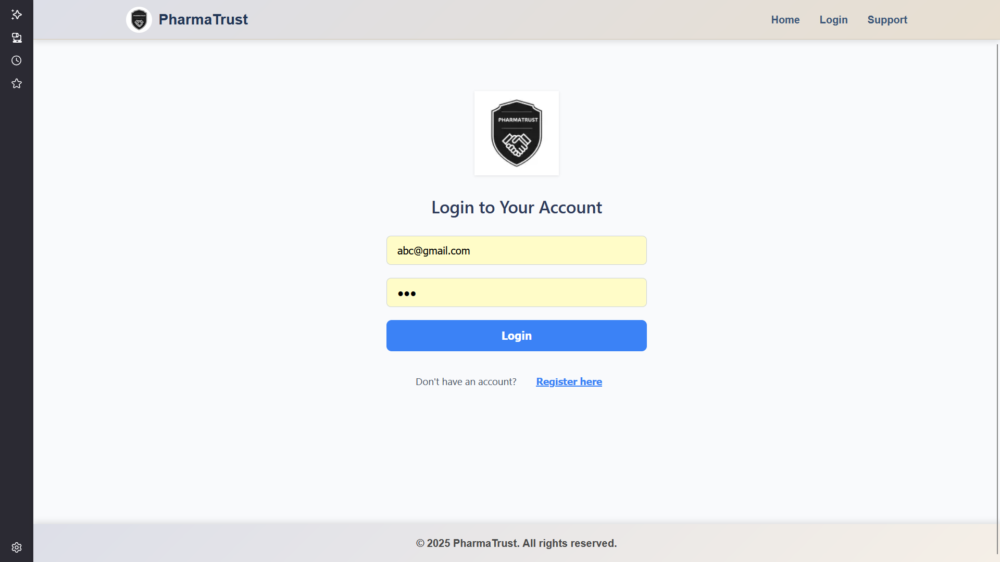
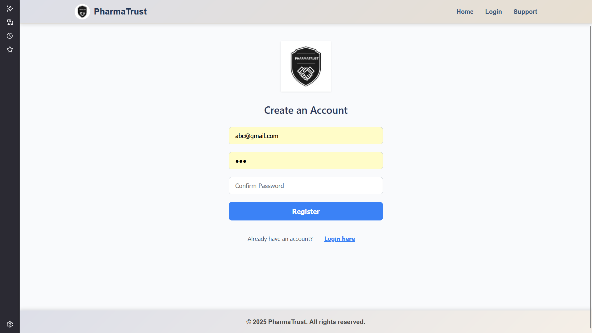
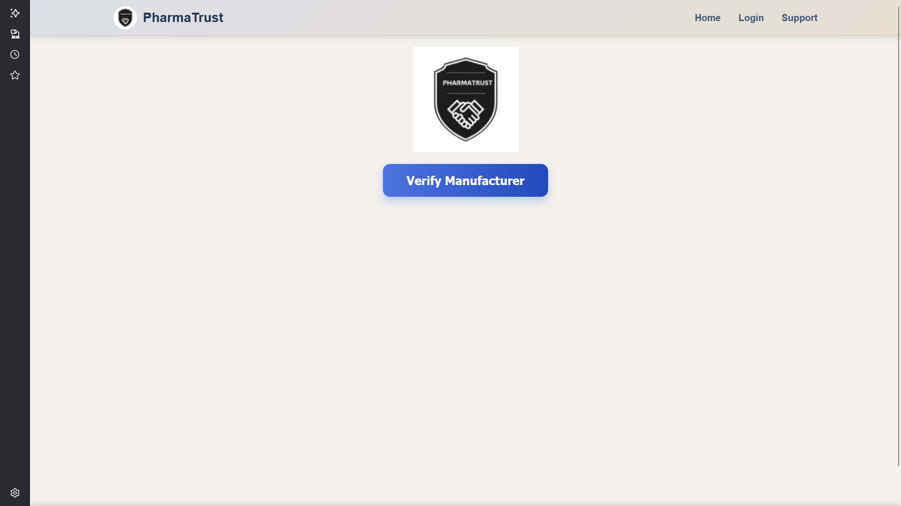
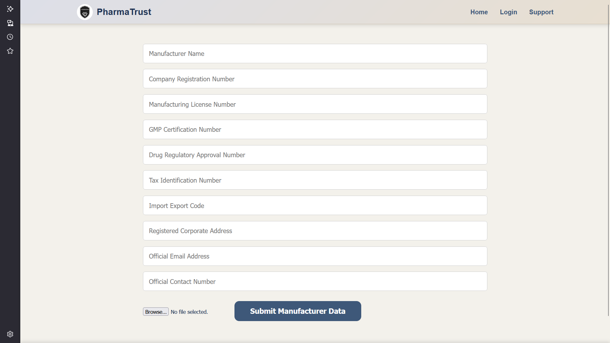
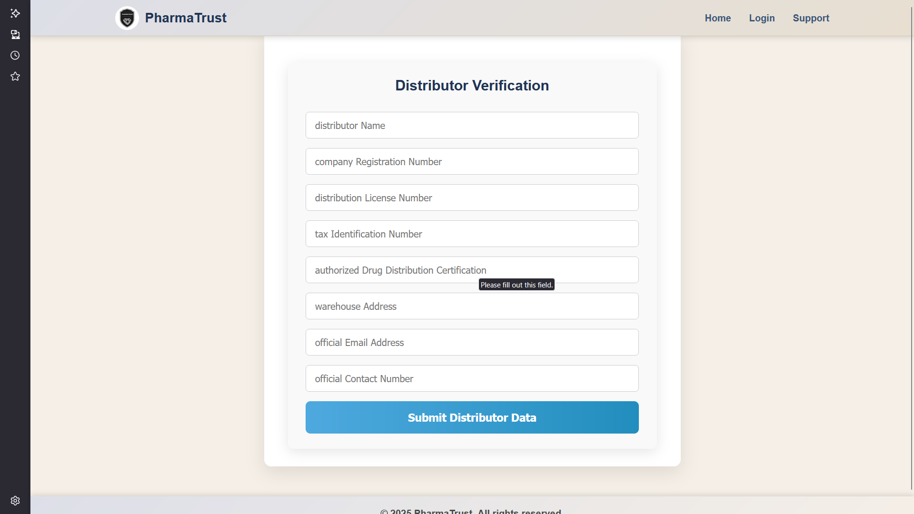
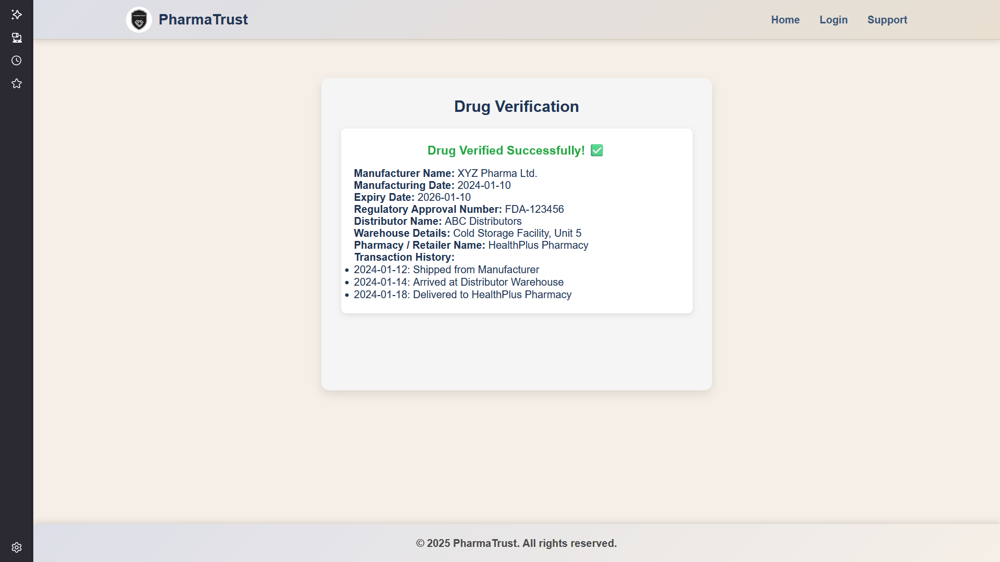
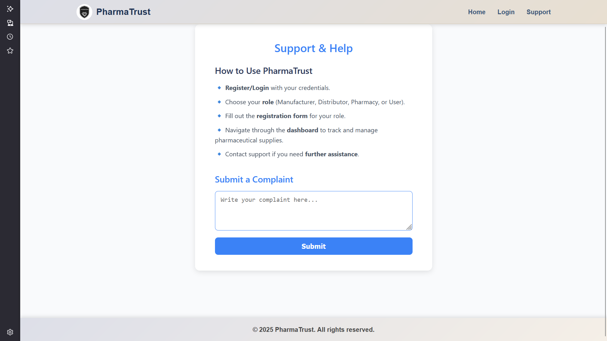

-->Pharmaceutical Drug Supply chain Management System

-->Problem Statement:
Many fake and low-quality medicines are entering the market, which can harm people’s health. There is no proper way to check if a drug is real or fake while it moves from the manufacturer to the user.

-->Solution: 
I created a supply chain system where each medicine is verified at every stage – by the manufacturer, distributor, pharmacy, and the user. Each role has secure access to add or check drug details, making sure only real and approved medicines reach the users. The system also allows users to verify any medicine before using it.

-->Why is it needed? 
This system helps stop fake drugs from being sold. It builds trust among all people involved – companies, sellers, and buyers – by making the medicine supply process safer, more secure, and easy to track.

-->Description : 
Developed a supply chain system to enhance drug authenticity and prevent counterfeit medicines. Implemented role-based access control for manufacturers, distributors,
pharmacies, and users, ensuring secure and verified drug transactions. Designed a responsive system that enables secure tracking and verification of drugs from the  manufacturing stage to the end-user, ensuring only authentic drugs enter the supply chain. Built the system to make the drug supply process more reliable and trustworthy for everyone involved.

-->Output Screenshots:

